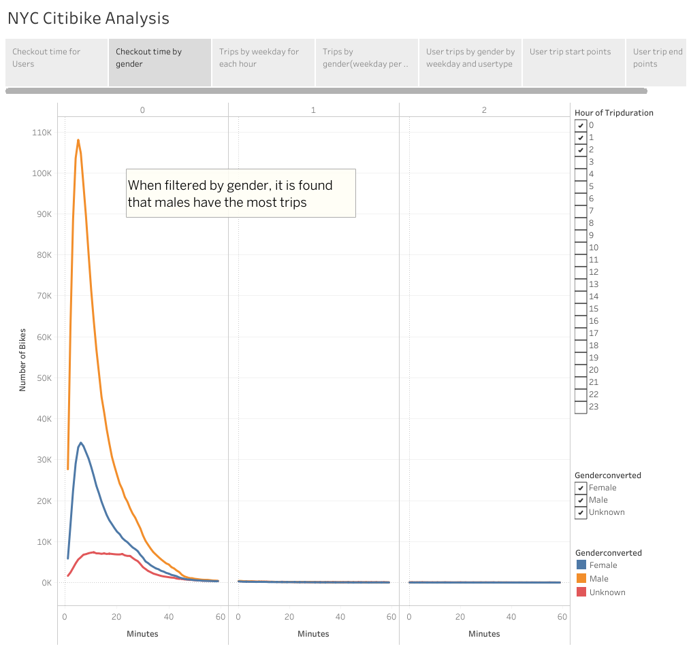
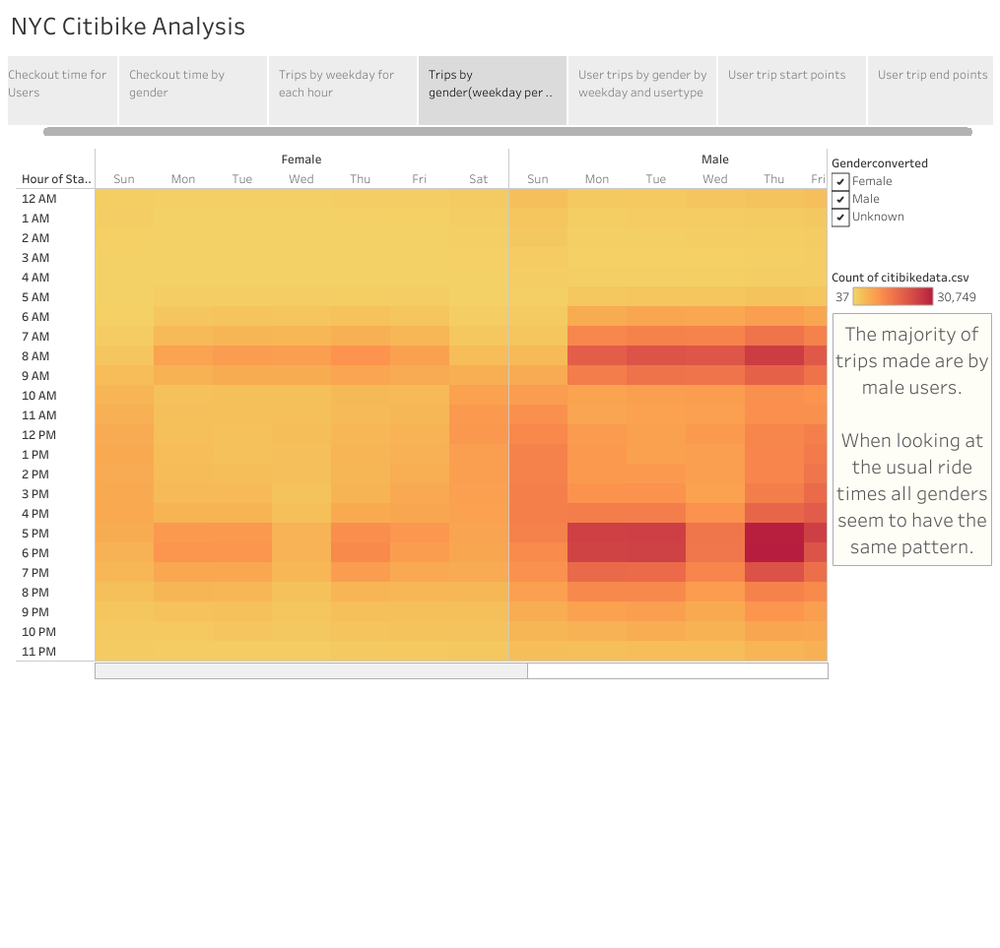
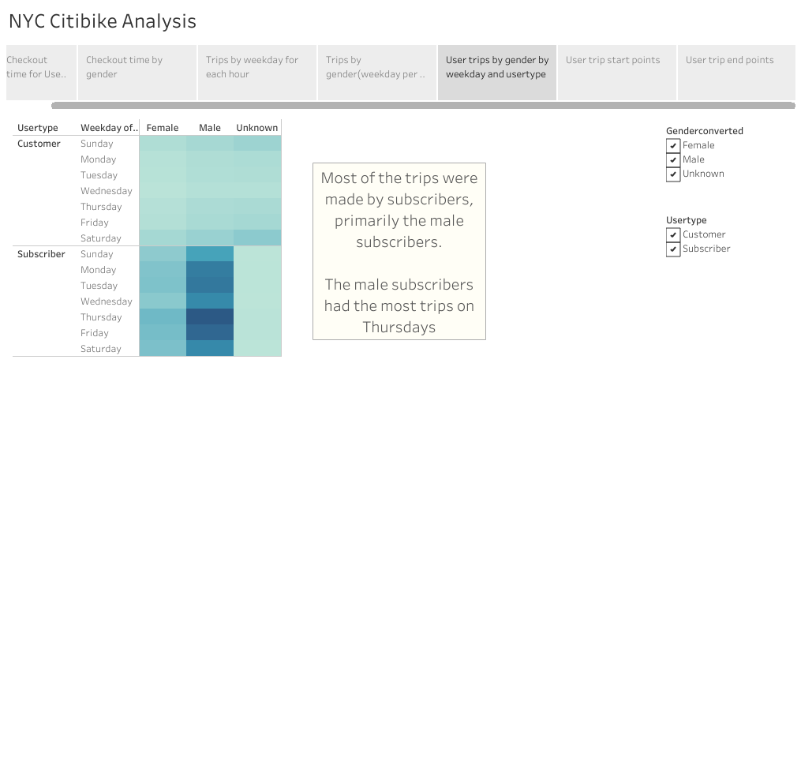
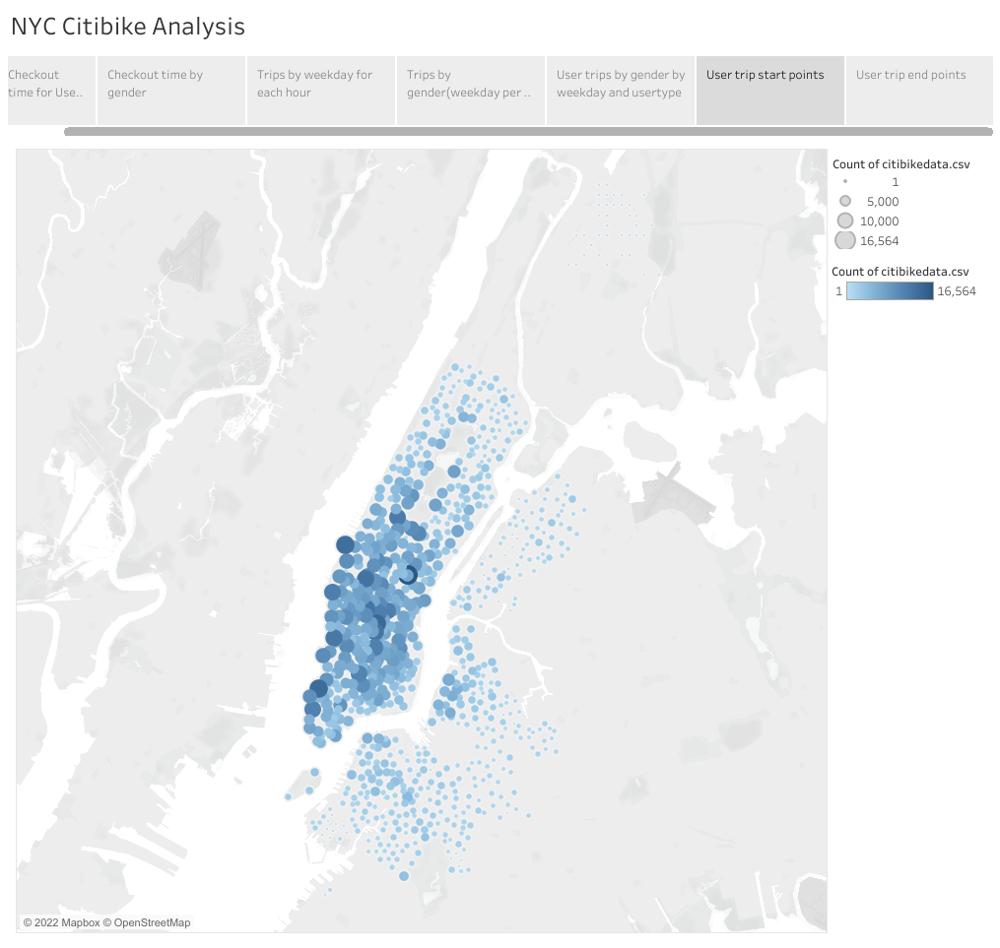
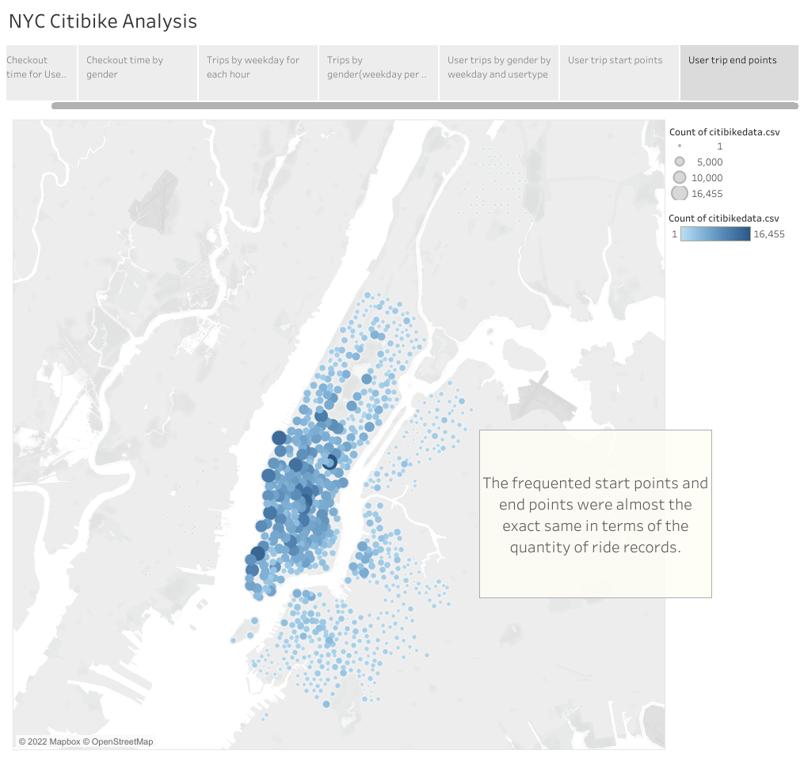

# NYC Citibike Analysis

# Overview
## Purpose

# Results

The link to the Tableau story and all visualizations on Tableau is below.

[link to dashboards](https://public.tableau.com/shared/TKG7GPZ39?:display_count=n&:origin=viz_share_link)

## Visualizations
There are descriptions provided below each visualization for clarification purposes.

### Visualization 1

* This first visualization shows that most rides are for a duration of around 5 minutes.

### Visualization 2

* The second visualization shows that male riders have the most trips. 5 minutes seems to be the duration that recurs the most regardless of gender.

### Visualization 3

* The third visualization shows that trips are usually made around 8am as well as 5-6pm on weekdays(excluding wednesday 5-6). On the weekends, trips seem to be made throughout the afternoon.

### Visualization 4

* The fourth visualization shows that a majority of the trips are made by male users at peak times. When looking at the usual ride times, all genders seem to have the same pattern.

### Visualization 5

* The fifth visualization shows that most of the trips are made by subscribers, primarily the male subscribers. The male subscribers had the most trips on Thursdays.

### Visualization 6

* The sixth visualization shows the popularity of the starting stations. The southwest area of NYC seems to contain some of the most popular starting stations. 

### Visualization 7

* The seventh visualization shows the popularity of the ending stations. The stations seem to be just as popular starting stations as ending stations. The popularity of the stations seems nearly identical in both this and the previous visualization.

# Summary

Some other visualizations that can be made would be to find the most common routes and how many people use them as well as .
