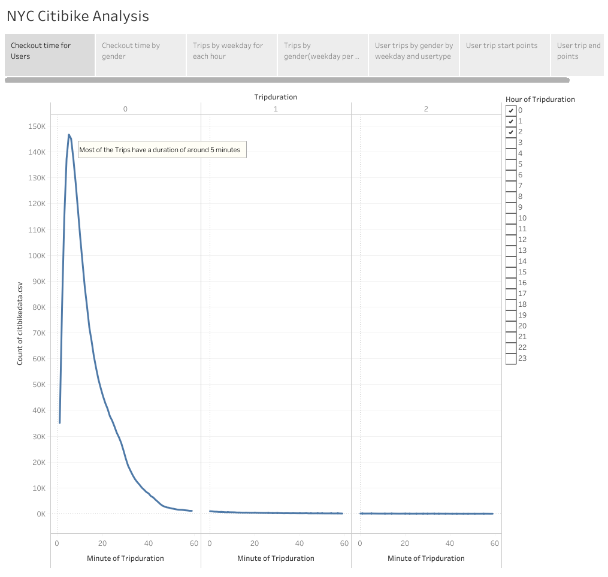
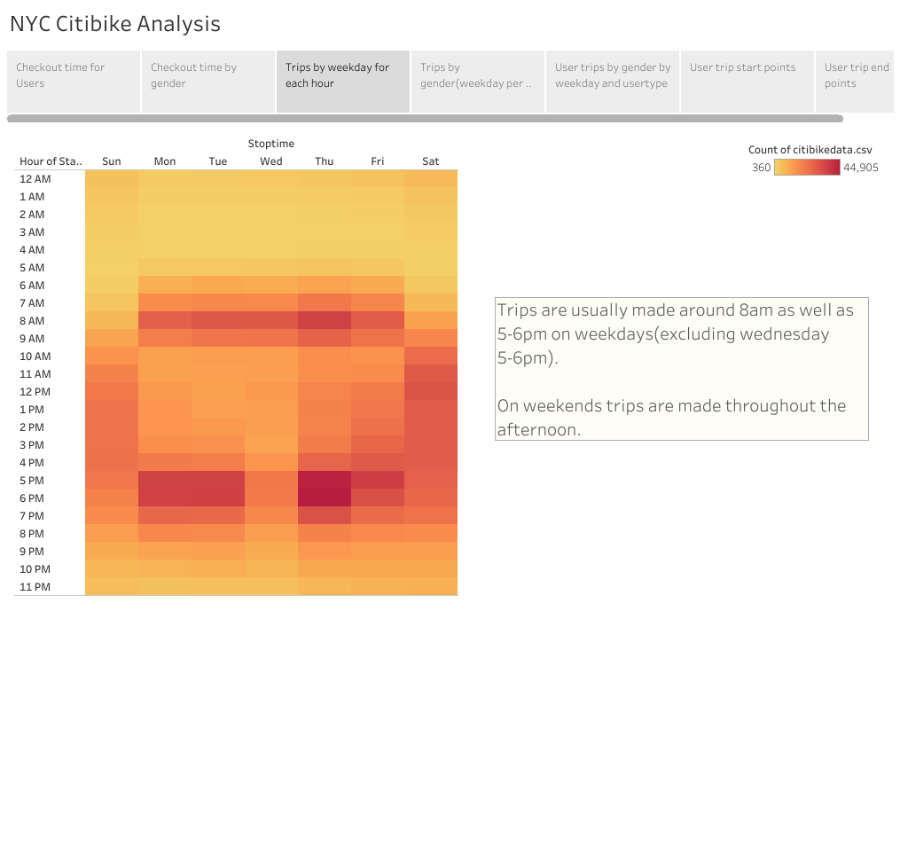

# NYC Citibike Analysis

# Overview
## Purpose

# Results

The link to the Tableau story and all visualizations on Tableau is below.

[link to dashboards](https://public.tableau.com/shared/TKG7GPZ39?:display_count=n&:origin=viz_share_link)

This first visualization shows that most rides are for a duration of around 5 minutes.

# Summary

Some other visualizations that can be made would be to find the most common routes and how many people use them as well as .
